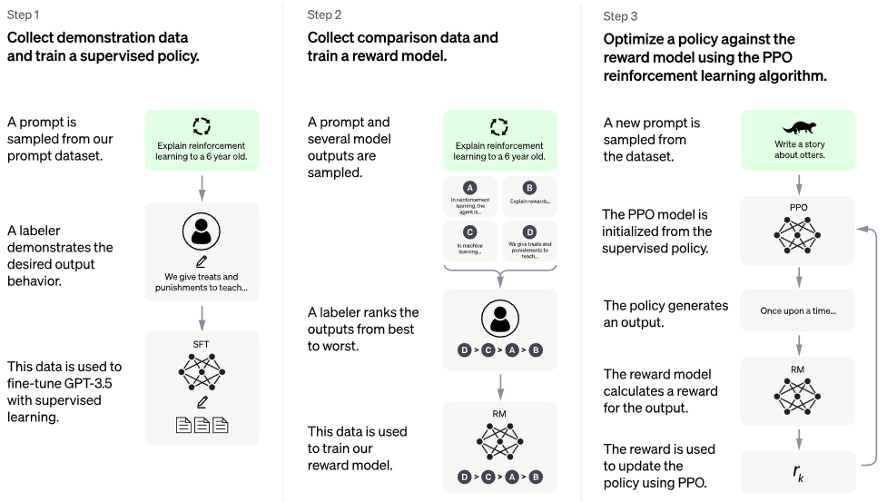

</img>

*<a href="https://openai.com/blog/chatgpt/">official chatgpt blogpost</a>*

## PaLM + RLHF - Pytorch (wip)

Implementation of RLHF (Reinforcement Learning with Human Feedback) on top of the PaLM architecture. Maybe I'll add retrieval functionality too, à la <a href="https://github.com/lucidrains/RETRO-pytorch">RETRO</a>

If you are interested in replicating something like ChatGPT out in the open, please consider joining <a href="https://discord.gg/xBPBXfcFHd">Laion </a>

Alternative: <a href="https://arxiv.org/abs/2302.02676">Chain of Hindsight</a>

## FAQ

- Does this contain a model for inference?

There is no trained model. This is just the ship and overall map. We still need millions of dollars of compute + data to sail to the correct point in high dimensional parameter space. Even then, you need professional sailors (like Robin Rombach of Stable Diffusion fame) to actually guide the ship through turbulent times to that point.

## Community

<a href="https://carper.ai/">CarperAI</a> had been working on <a href="https://github.com/CarperAI/trlx">an RLHF framework</a> for large language models for many months prior to the release of ChatGPT.

<a href="https://www.youtube.com/watch?v=sswA4j_IUxg">Yannic Kilcher</a> is also working on an <a href="https://github.com/LAION-AI/Open-Assistant">open sourced implementation</a>

<a href="https://www.youtube.com/watch?v=SWwQ3k-DWyo">AI Coffeebreak w/ Letitia</a> | <a href="https://www.youtube.com/watch?v=NpmnWgQgcsA">Code Emporium</a> | <a href="https://www.youtube.com/watch?v=_MPJ3CyDokU">Code Emporium Part 2</a>

## Appreciation

- <a href="https://stability.ai/">Stability.ai</a> for the generous sponsorship to work on cutting edge artificial intelligence research

- <a href="https://huggingface.co/">🤗 Hugging Face</a> and <a href="https://carper.ai/">CarperAI</a> for penning the blog post <a href="https://huggingface.co/blog/rlhf">Illustrating Reinforcement Learning from Human Feedback (RLHF)</a>, and the former also for their <a href="https://huggingface.co/docs/accelerate/index">accelerate</a> library

- <a href="https://github.com/kisseternity">@kisseternity</a> and <a href="https://github.com/taynoel84">@taynoel84</a> for the code review and finding bugs

- <a href="https://github.com/conceptofmind">Enrico</a> for integrating <a href="https://arxiv.org/abs/2205.14135">Flash Attention</a> from Pytorch 2.0

## Install

```bash
$ pip install palm-rlhf-pytorch
```

## Usage

First train `PaLM`, like any other autoregressive transformer

```python
import torch
from palm_rlhf_pytorch import PaLM

palm = PaLM(
    num_tokens = 20000,
    dim = 512,
    depth = 12,
    flash_attn = True # https://arxiv.org/abs/2205.14135
).cuda()

seq = torch.randint(0, 20000, (1, 2048)).cuda()

loss = palm(seq, return_loss = True)
loss.backward()

# after much training, you can now generate sequences

generated = palm.generate(2048) # (1, 2048)
```

Then train your reward model, with the curated human feedback. In the original paper, they could not get reward model to be finetuned from a pretrained transformer without overfitting, but I gave the option to finetune with `LoRA` anyways, since it is still open research.

```python
import torch
from palm_rlhf_pytorch import PaLM, RewardModel

palm = PaLM(
    num_tokens = 20000,
    dim = 512,
    depth = 12,
    causal = False
)

reward_model = RewardModel(
    palm,
    num_binned_output = 5 # say rating from 1 to 5
).cuda()

# mock data

seq = torch.randint(0, 20000, (1, 1024)).cuda()
prompt_mask = torch.zeros(1, 1024).bool().cuda() # which part of the sequence is prompt, which part is response
labels = torch.randint(0, 5, (1,)).cuda()

# train

loss = reward_model(seq, prompt_mask = prompt_mask, labels = labels)
loss.backward()

# after much training

reward = reward_model(seq, prompt_mask = prompt_mask)
```

Then you will pass your transformer and the rewards model to the `RLHFTrainer`

```python
import torch
from palm_rlhf_pytorch import PaLM, RewardModel, RLHFTrainer

# load your pretrained palm

palm = PaLM(
    num_tokens = 20000,
    dim = 512,
    depth = 12
).cuda()

palm.load('./path/to/pretrained/palm.pt')

# load your pretrained reward model

reward_model = RewardModel(
    palm,
    num_binned_output = 5
).cuda()

reward_model.load('./path/to/pretrained/reward_model.pt')

# ready your list of prompts for reinforcement learning

prompts = torch.randint(0, 256, (50000, 512)).cuda() # 50k prompts

# pass it all to the trainer and train

trainer = RLHFTrainer(
    palm = palm,
    reward_model = reward_model,
    prompt_token_ids = prompts
)

trainer.train(num_episodes = 50000)

# then, if it succeeded...
# generate say 10 samples and use the reward model to return the best one

answer = trainer.generate(2048, prompt = prompts[0], num_samples = 10) # (<= 2048,)
```

## Todo

- [x] clone base transformer with separate lora for critic
- [x] also allow for non-LoRA based finetuning
- [x] redo normalize to be able to have a masked version, not sure if anyone will ever use per token rewards / values, but good practice to implement
- [x] equip with <a href="https://github.com/hazyResearch/flash-attention">the best attention</a>

- [ ] add Hugging Face accelerate and test out wandb instrumentation
- [ ] search literature to figure out what is the latest SOTA for PPO, assuming RL field is still making progress.
- [ ] test the system using a pretrained sentiment network as reward model
- [ ] write the memory in PPO to memmapped numpy file
- [ ] get sampling with variable lengthed prompts working, even if it is not needed given bottleneck is human feedback
- [ ] allow for finetuning penultimate N layers only in either actor or critic, assuming if pretrained
- [ ] incorporate some learning points from Sparrow, given Letitia's video
- [ ] simple web interface with django + htmx for collecting human feedback
- [ ] consider <a href="https://www.anthropic.com/constitutional.pdf">RLAIF</a>

## Citations

```bibtex
@article{Stiennon2020LearningTS,
    title   = {Learning to summarize from human feedback},
    author  = {Nisan Stiennon and Long Ouyang and Jeff Wu and Daniel M. Ziegler and Ryan J. Lowe and Chelsea Voss and Alec Radford and Dario Amodei and Paul Christiano},
    journal = {ArXiv},
    year    = {2020},
    volume  = {abs/2009.01325}
}
```

```bibtex
@inproceedings{Chowdhery2022PaLMSL,
    title   = {PaLM: Scaling Language Modeling with Pathways},
    author  = {Aakanksha Chowdhery and Sharan Narang and Jacob Devlin and Maarten Bosma and Gaurav Mishra and Adam Roberts and Paul Barham and Hyung Won Chung and Charles Sutton and Sebastian Gehrmann and Parker Schuh and Kensen Shi and Sasha Tsvyashchenko and Joshua Maynez and Abhishek Rao and Parker Barnes and Yi Tay and Noam M. Shazeer and Vinodkumar Prabhakaran and Emily Reif and Nan Du and Benton C. Hutchinson and Reiner Pope and James Bradbury and Jacob Austin and Michael Isard and Guy Gur-Ari and Pengcheng Yin and Toju Duke and Anselm Levskaya and Sanjay Ghemawat and Sunipa Dev and Henryk Michalewski and Xavier Garc{\'i}a and Vedant Misra and Kevin Robinson and Liam Fedus and Denny Zhou and Daphne Ippolito and David Luan and Hyeontaek Lim and Barret Zoph and Alexander Spiridonov and Ryan Sepassi and David Dohan and Shivani Agrawal and Mark Omernick and Andrew M. Dai and Thanumalayan Sankaranarayana Pillai and Marie Pellat and Aitor Lewkowycz and Erica Oliveira Moreira and Rewon Child and Oleksandr Polozov and Katherine Lee and Zongwei Zhou and Xuezhi Wang and Brennan Saeta and Mark Diaz and Orhan Firat and Michele Catasta and Jason Wei and Kathleen S. Meier-Hellstern and Douglas Eck and Jeff Dean and Slav Petrov and Noah Fiedel},
    year    = {2022}
}
```

```bibtex
@article{Hu2021LoRALA,
    title   = {LoRA: Low-Rank Adaptation of Large Language Models},
    author  = {Edward J. Hu and Yelong Shen and Phillip Wallis and Zeyuan Allen-Zhu and Yuanzhi Li and Shean Wang and Weizhu Chen},
    journal = {ArXiv},
    year    = {2021},
    volume  = {abs/2106.09685}
}
```

```bibtex
@inproceedings{Sun2022ALT,
    title     = {A Length-Extrapolatable Transformer},
    author    = {Yutao Sun and Li Dong and Barun Patra and Shuming Ma and Shaohan Huang and Alon Benhaim and Vishrav Chaudhary and Xia Song and Furu Wei},
    year      = {2022}
}
```

```bibtex
@misc{gilmer2023intriguing
    title  = {Intriguing Properties of Transformer Training Instabilities},
    author = {Justin Gilmer, Andrea Schioppa, and Jeremy Cohen},
    year   = {2023},
    status = {to be published - one attention stabilization technique is circulating within Google Brain, being used by multiple teams}
}
```

```bibtex
@inproceedings{dao2022flashattention,
    title   = {Flash{A}ttention: Fast and Memory-Efficient Exact Attention with {IO}-Awareness},
    author  = {Dao, Tri and Fu, Daniel Y. and Ermon, Stefano and Rudra, Atri and R{\'e}, Christopher},
    booktitle = {Advances in Neural Information Processing Systems},
    year    = {2022}
}
```
